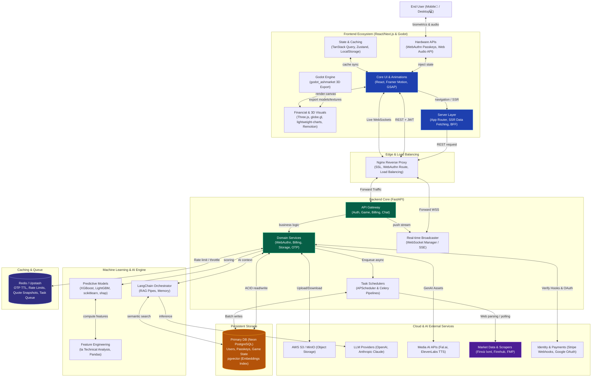

# System Architecture and Data Flow

Below is the complete data flow mapping from user interaction, frontend/backend logic, all the way to primary DB persistence and cache handling.



## Render `system_design.puml` (PlantUML)

The PlantUML file uses **`!pragma layout smetana`** so it does **not** require Graphviz (`dot`)—only Java.

1. **Download the JAR** (one-time), e.g. from [PlantUML releases](https://github.com/plantuml/plantuml/releases):

   ```bash
   curl -sL -o plantuml.jar \
     "https://github.com/plantuml/plantuml/releases/download/v1.2024.7/plantuml-1.2024.7.jar"
   ```

2. **Generate PNG** next to the `.puml` file:

   ```bash
   java -jar plantuml.jar -charset UTF-8 doc/system_design.puml
   ```

   Output: `doc/system_design.png`.

**Alternatives**

- **VS Code**: install the “PlantUML” extension, open `system_design.puml`, run the preview / export command.
- **Docker** (if Docker is running):  
  `docker run --rm -v "$PWD/doc:/data" plantuml/plantuml /data/system_design.puml`
- **Homebrew** (installs Graphviz + plantuml):  
  `brew install plantuml` then `plantuml doc/system_design.puml`
