# QuantTrade AI — Full System Design & Architecture

> Generated 2026-05-02. Covers all features: Markets · Copilot RAG · Portfolio · Screener · Community · Global Monitor · QuantTrade Life · Auth · Billing · Admin.

---

## 1. System Context Diagram (C4 Level 1)

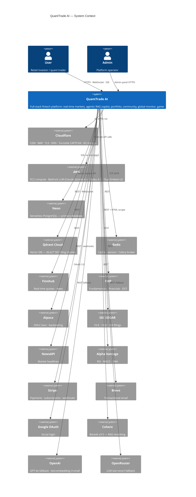

---

## 2. Container Diagram (C4 Level 2)

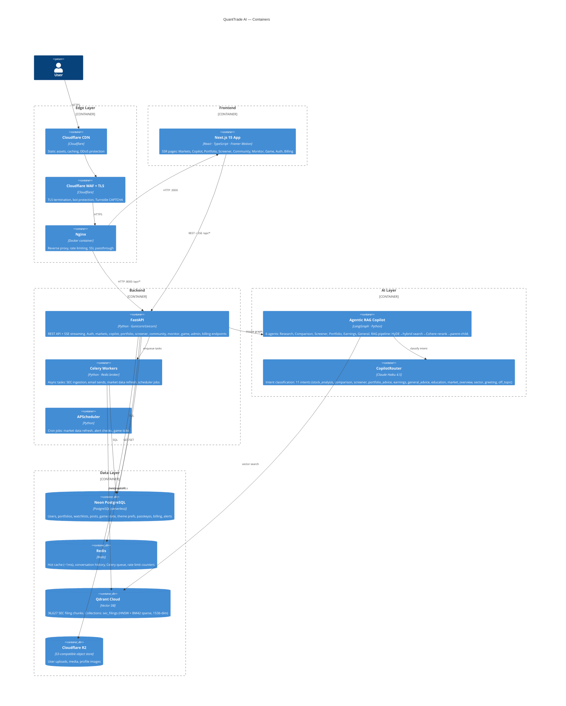

---

## 3. High Level Design — Full Platform

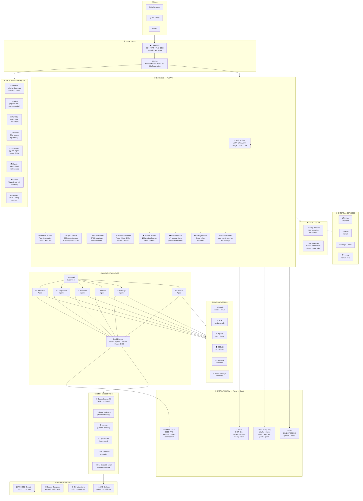

---

## 4. Request Flow — Copilot Query (Sequence Diagram)

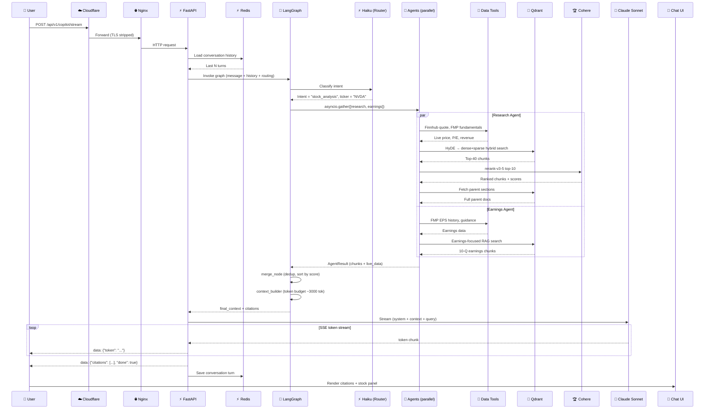

---

## 5. Authentication Flow (Sequence Diagram)

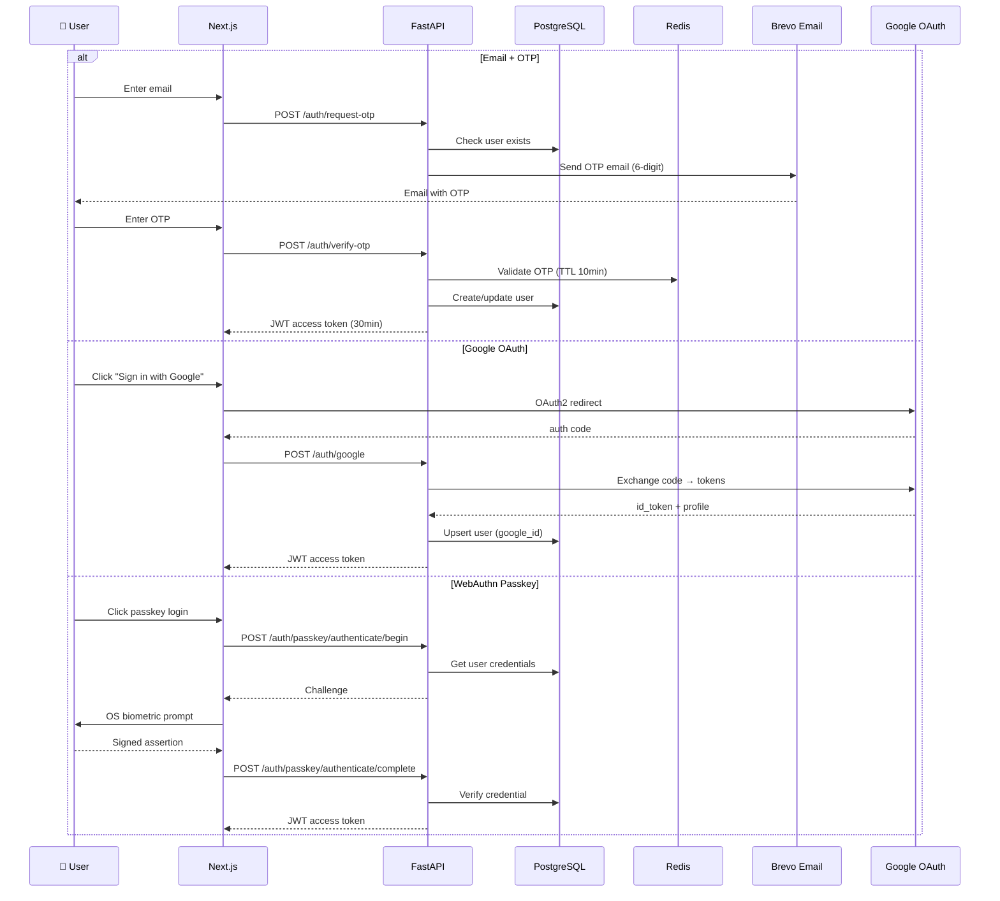

---

## 6. Data Architecture (Hot / Warm / Cold)

```mermaid
flowchart LR
    REQ["📥 Incoming\nRequest"]

    subgraph HOT ["⚡ HOT PATH ~1ms"]
        R1["Redis GET\nsession token"]
        R2["Redis GET\ncached quote"]
        R3["Redis GET\nconv history"]
        R4["Redis RPUSH\nCelery task"]
    end

    subgraph WARM ["🐘 WARM PATH ~10ms"]
        W1["PostgreSQL SELECT\nuser profile"]
        W2["PostgreSQL SELECT\nportfolio positions"]
        W3["PostgreSQL SELECT\ncommunity posts"]
        W4["PostgreSQL UPSERT\ngame state"]
    end

    subgraph COLD ["🔮 COLD PATH ~50-400ms"]
        C1["Qdrant vector search\nRAG chunks"]
        C2["EDGAR HTTP fetch\nSEC filing HTML"]
        C3["Finnhub REST\nreal-time quotes"]
        C4["FMP REST\nfundamentals"]
    end

    subgraph OBJ ["☁️ OBJECT STORE"]
        O1["R2 presigned URL\nuser uploads"]
        O2["R2 presigned URL\nprofile images"]
    end

    REQ --> HOT
    HOT -->|miss| WARM
    WARM -->|not in DB| COLD
    REQ --> OBJ

    subgraph WRITE ["✏️ WRITE PATHS"]
        WR1["Redis SET cache\n(TTL 60s)"]
        WR2["PostgreSQL INSERT\n+ Redis invalidate"]
        WR3["Qdrant upsert\n(via Celery batch)"]
    end
```

---

## 7. Infrastructure & Deployment Diagram

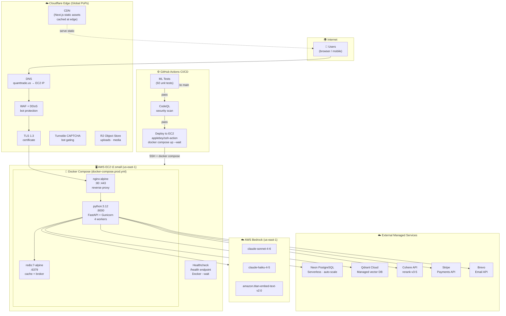

---

## 8. Database Schema — Entity Relationship Diagram

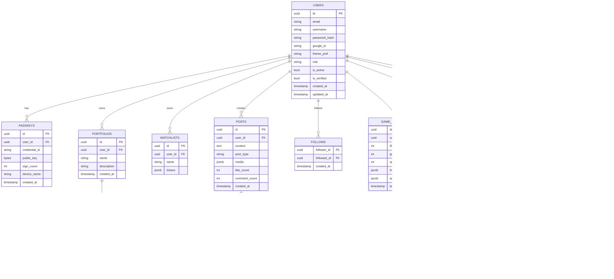

---

## 9. API Architecture

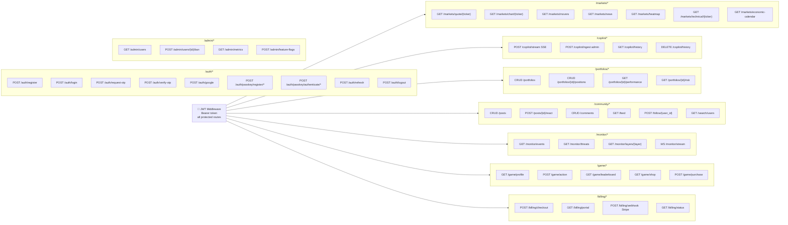

---

## 10. SEC Ingestion Pipeline (Detailed)

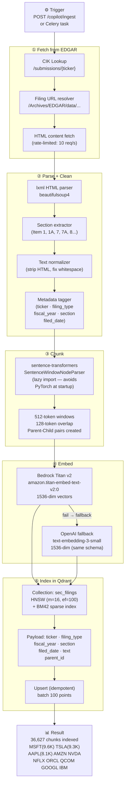

---

## 11. Feature → Module Map

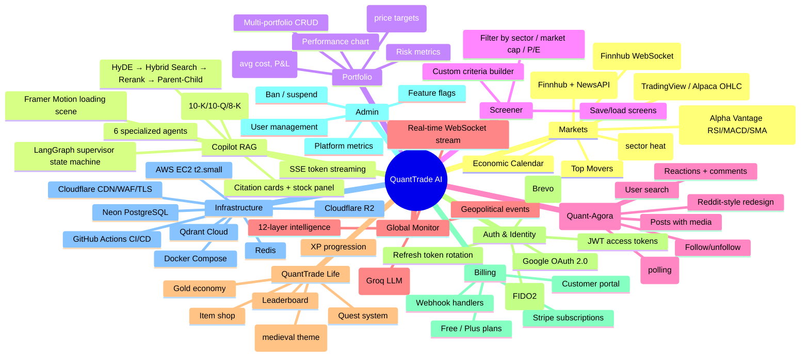

---

## 12. Current vs Production-Scale Gap Analysis

| Layer (from diagram) | Current | Production-Scale Next Step |
|---------------------|---------|---------------------------|
| ① EDGE | ✅ Cloudflare CDN+WAF+TLS | Add Cloudflare Workers for edge auth |
| ② ROUTING | ❌ Single EC2 | Add NLB + Route 53 health routing |
| ③ REGION | ❌ us-east-1 only | Add us-west-2 read replica (Neon branching) |
| ④ CELLS | ❌ Monolith | Split Copilot + Markets into separate services |
| ⑤ CLUSTER | ⚠️ Nginx only | Migrate to ECS Fargate or k8s (EKS) |
| ⑥ SERVICE MESH | ❌ Direct Docker network | Add Envoy or use AWS App Mesh |
| ⑦ DATA LAYER | ✅ Hot/Warm/Cold | Add Neon read replica for heavy read traffic |

