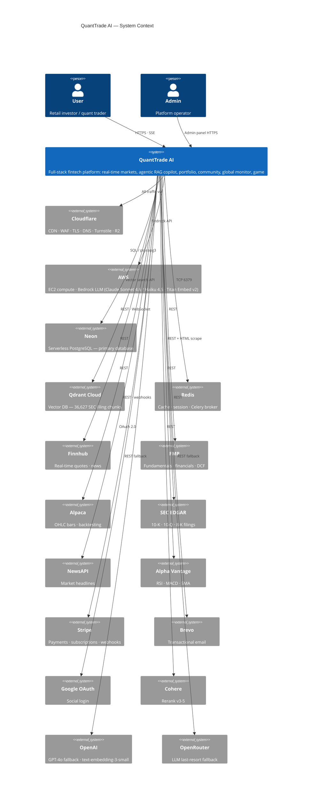

# System Context Diagram (C4 Level 1)

> QuantTrade AI in context of all users and external systems.

```mermaid
C4Context
    title QuantTrade AI — System Context

    Person(user, "User", "Retail investor / quant trader")
    Person(admin, "Admin", "Platform operator")

    System(qt, "QuantTrade AI", "Full-stack fintech platform: real-time markets, agentic RAG copilot, portfolio, community, global monitor, game")

    System_Ext(cloudflare, "Cloudflare", "CDN · WAF · TLS · DNS · Turnstile · R2")
    System_Ext(aws, "AWS", "EC2 compute · Bedrock LLM (Claude Sonnet 4.6 / Haiku 4.5 · Titan Embed v2)")
    System_Ext(neon, "Neon", "Serverless PostgreSQL — primary database")
    System_Ext(qdrant, "Qdrant Cloud", "Vector DB — 36,627 SEC filing chunks")
    System_Ext(redis, "Redis", "Cache · session · Celery broker")

    System_Ext(finnhub, "Finnhub", "Real-time quotes · news")
    System_Ext(fmp, "FMP", "Fundamentals · financials · DCF")
    System_Ext(alpaca, "Alpaca", "OHLC bars · backtesting")
    System_Ext(edgar, "SEC EDGAR", "10-K · 10-Q · 8-K filings")
    System_Ext(newsapi, "NewsAPI", "Market headlines")
    System_Ext(av, "Alpha Vantage", "RSI · MACD · SMA")

    System_Ext(stripe, "Stripe", "Payments · subscriptions · webhooks")
    System_Ext(brevo, "Brevo", "Transactional email")
    System_Ext(google, "Google OAuth", "Social login")
    System_Ext(cohere, "Cohere", "Rerank v3-5")
    System_Ext(openai, "OpenAI", "GPT-4o fallback · text-embedding-3-small")
    System_Ext(openrouter, "OpenRouter", "LLM last-resort fallback")

    Rel(user, qt, "HTTPS · SSE")
    Rel(admin, qt, "Admin panel HTTPS")
    Rel(qt, cloudflare, "All traffic via")
    Rel(qt, aws, "Bedrock API")
    Rel(qt, neon, "SQL / psycopg3")
    Rel(qt, qdrant, "Vector search API")
    Rel(qt, redis, "TCP 6379")
    Rel(qt, finnhub, "REST · WebSocket")
    Rel(qt, fmp, "REST")
    Rel(qt, alpaca, "REST")
    Rel(qt, edgar, "REST + HTML scrape")
    Rel(qt, newsapi, "REST")
    Rel(qt, av, "REST")
    Rel(qt, stripe, "REST · webhooks")
    Rel(qt, brevo, "REST")
    Rel(qt, google, "OAuth 2.0")
    Rel(qt, cohere, "REST")
    Rel(qt, openai, "REST fallback")
    Rel(qt, openrouter, "REST fallback")
```

​
