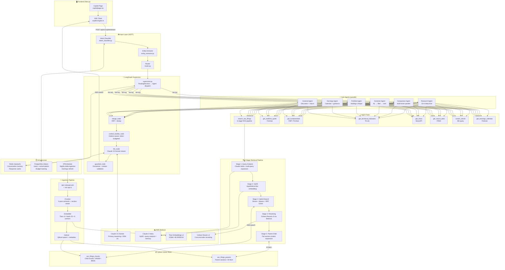
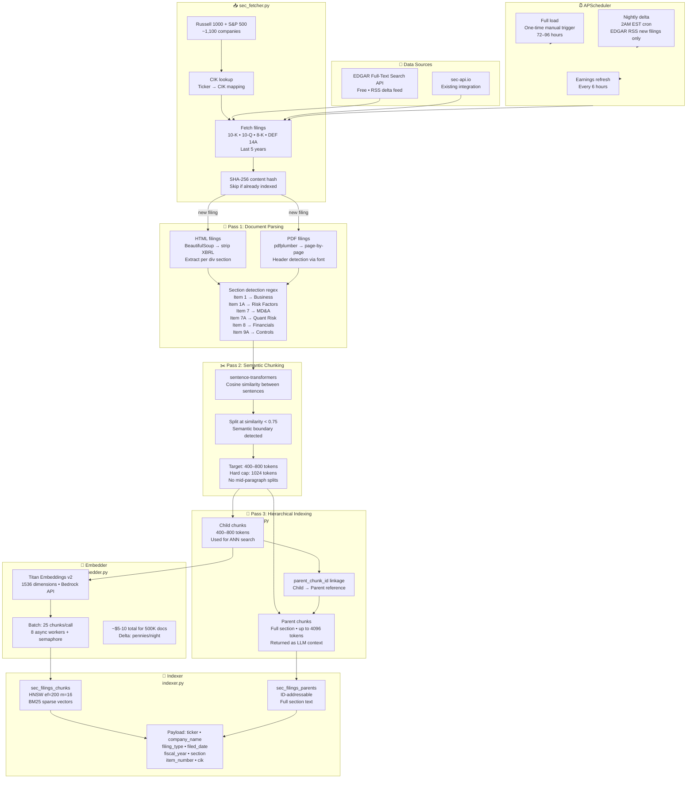
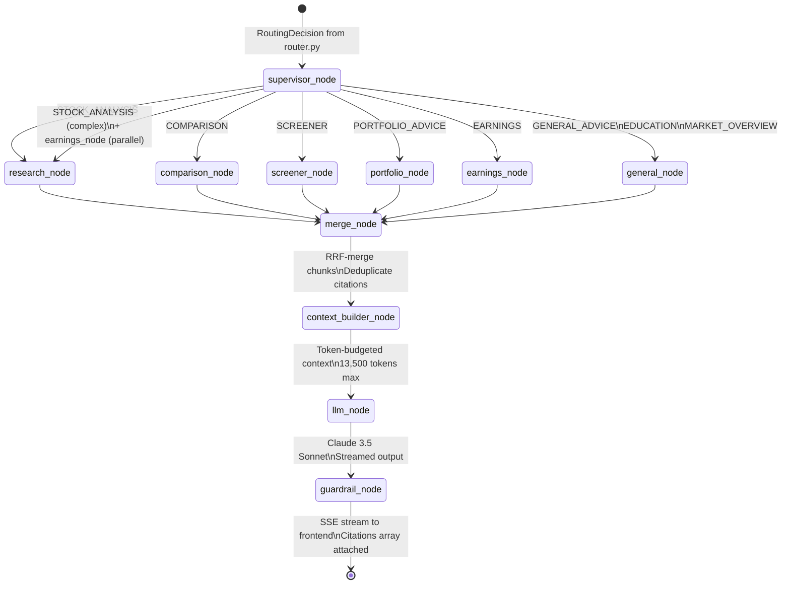
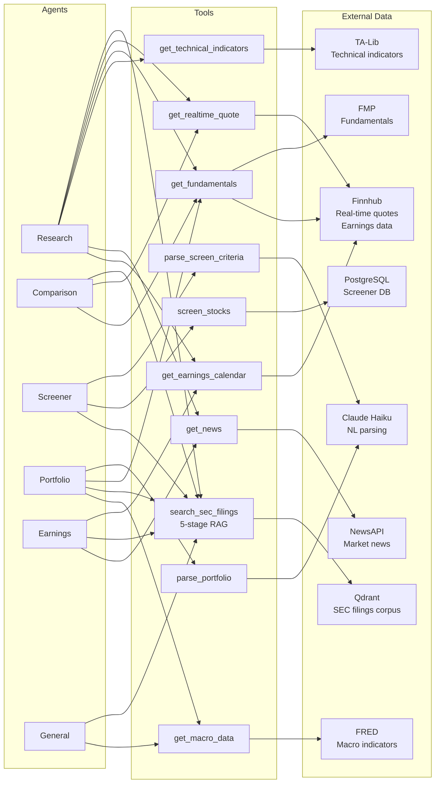
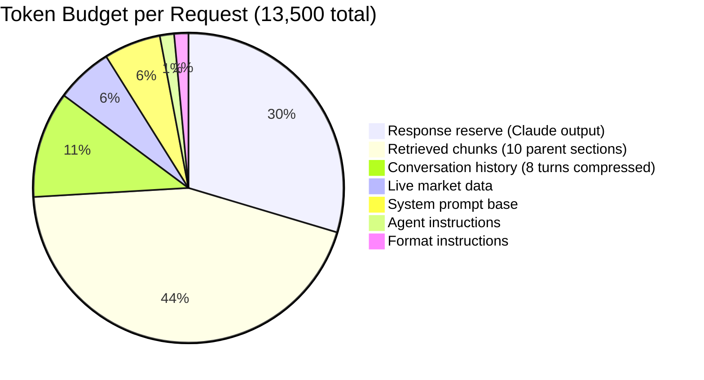
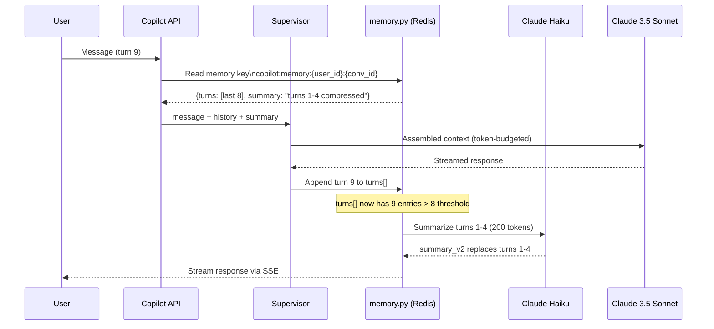

# Agentic RAG Financial Copilot — Design Spec

Date: 2026-05-01
Status: Approved
Approach: Big Bang Replacement (Approach A)
Author: Yash Joshi + Claude

---

## 0. Architecture Diagrams

### 0.1 High-Level System Architecture (HLD)



---

### 0.2 Ingestion Pipeline (Detailed)



---

### 0.3 5-Stage Retrieval Pipeline

```mermaid
flowchart TD
    Q["User Query\ne.g. 'What are Apple's biggest risks in China?'"]

    subgraph S1["Stage 1 · Query Analysis — Claude Haiku ~200ms"]
        QA["Extract: tickers • filing_types\nsections • date_range"]
        MQ["Generate 3–5 query variants\nApple supply chain risk\nAAPL China manufacturing risk\nApple geographic revenue risk"]
    end

    subgraph S2["Stage 2 · HyDE — Claude Haiku ~300ms (parallel)"]
        HYPO["Generate hypothetical answer\n'Apple faces 19% China revenue concentration\nFoxconn Zhengzhou supply chain risk...'"]
        HYPO_EMBED["Embed hypothetical doc\nTitan v2 → 1536d vector"]
    end

    subgraph S3["Stage 3 · Hybrid Search — Qdrant ~80ms (3 parallel)"]
        DENSE["Dense search\nTitan v2 semantic similarity\nMetadata-filtered by ticker/date/section\nTop 50"]
        SPARSE["Sparse search\nBM25 keyword matching (fastembed)\nTop 50"]
        SECTION["Section-targeted\nDense • no ticker filter\nCross-company patterns\nTop 30"]
        RRF["RRF Fusion\nscore = Σ 1/(60 + rank_i)\nTop 50 unique chunks"]
    end

    subgraph S4["Stage 4 · Cross-Encoder Reranking — Cohere ~150ms (async)"]
        PAIRS["(query, chunk) pairs\nRead together by cross-encoder\nFar more accurate than cosine sim"]
        TOP10["Rerank 50 → Top 10\nEliminates irrelevant chunks\n~$0.0001/call"]
    end

    subgraph S5["Stage 5 · Parent-Child Expansion — Qdrant ID fetch ~30ms"]
        PARENT_FETCH["Fetch parent_chunk_id\nfrom each top-10 child payload"]
        FULL_CTX["Return full parent section\nUp to 4096 tokens per chunk\nNo truncated mid-sentence context"]
        CITE["Attach citation\n[Source N: AAPL 10-K 2024, Risk Factors]\nFiled: 2024-11-01 | CIK: 0000320193"]
    end

    RESULT["Top-10 grounded chunks\nwith structured citations\n→ Context Builder"]

    Q --> QA --> MQ
    Q --> HYPO --> HYPO_EMBED
    MQ --> DENSE & SPARSE & SECTION
    HYPO_EMBED --> DENSE
    DENSE & SPARSE & SECTION --> RRF
    RRF --> PAIRS --> TOP10
    TOP10 --> PARENT_FETCH --> FULL_CTX --> CITE --> RESULT

    style S1 fill:#1e3a5f,stroke:#3b82f6
    style S2 fill:#1e3a5f,stroke:#3b82f6
    style S3 fill:#1a3a2a,stroke:#22c55e
    style S4 fill:#3a1e2a,stroke:#f43f5e
    style S5 fill:#2a2a1e,stroke:#eab308
```



---

### 0.4 LangGraph Agent Topology



---

### 0.5 Agent Tools & Data Sources Map



---

### 0.6 Context Assembly & Token Budget



---

### 0.7 Memory Architecture



---

## 1. Overview

Replace the existing QuantTrade AI Copilot pipeline with a production-grade Agentic RAG system powered by:

* LangGraph multi-agent orchestration (supervisor + 6 sub-agents)
* AWS Bedrock for Claude 3.5 Sonnet inference + Titan Embeddings v2
* Qdrant vector store with hybrid dense+sparse search
* 5-stage retrieval pipeline (HyDE → hybrid search → reranking → parent-child expansion)
* 500K document corpus (Russell 1000 + S\&P 500 + major ETF holdings, SEC 10-K/10-Q/8-K/DEF 14A)

***

## 2. What Gets Deleted vs Kept

### Deleted

* backend/app/services/copilot/retrieval.py
* backend/app/services/copilot/knowledge\_base.py
* backend/app/services/copilot/llm\_router.py
* backend/app/services/copilot/rag\_service.py
* backend/app/api/copilot\_stream.py
* backend/app/api/chat.py (copilot routes only)

### Kept

* backend/app/services/copilot/intent\_classifier.py — solid, unchanged
* backend/app/services/copilot/entity\_extractor.py — solid, unchanged
* backend/app/services/copilot/router.py — solid, unchanged
* backend/app/services/copilot/constants.py — shared vocab, unchanged
* SSE infrastructure, Redis, budget guards, rate limits

***

## 3. New Module Structure

```
backend/app/services/agentic/
├── supervisor.py              # LangGraph supervisor state machine
├── agents/
│   ├── research.py            # Stock analysis + 10-K deep dive
│   ├── comparison.py          # Multi-ticker parallel analysis
│   ├── screener.py            # NL → filter → rank universe
│   ├── portfolio.py           # Holdings critique + risk analysis
│   ├── earnings.py            # Calendar + guidance + estimates
│   └── general.py             # Education + market overview
├── tools/
│   ├── rag_tool.py            # search_sec_filings (5-stage pipeline)
│   ├── market_tool.py         # quotes, fundamentals, technicals
│   ├── news_tool.py           # news + sentiment
│   └── macro_tool.py          # FRED, economic calendar
├── retrieval/
│   ├── hybrid_search.py       # Dense + sparse + RRF fusion
│   ├── hyde.py                # Hypothetical Document Embeddings
│   ├── reranker.py            # Cohere Rerank v3 via Bedrock
│   └── parent_child.py        # Hierarchical chunk retrieval
├── ingestion/
│   ├── sec_fetcher.py         # EDGAR API + sec-api.io
│   ├── chunker.py             # Semantic + section-aware chunking
│   ├── embedder.py            # Titan Embeddings v2 via Bedrock
│   └── indexer.py             # Qdrant upsert + metadata
├── memory.py                  # Redis sliding window + summarization
├── context_builder.py         # Citation-aware, token-budgeted assembly
└── bedrock_client.py          # Claude 3.5 Sonnet + Titan + Cohere Rerank
```

New API endpoints:

```
POST /api/v1/copilot/stream         # SSE — replaces existing
POST /api/v1/copilot/ingest         # admin: trigger manual ingestion
GET  /api/v1/copilot/ingest/status  # ingestion progress
GET  /api/v1/copilot/health         # Qdrant + Bedrock connectivity
```

***

## 4. Ingestion Pipeline

### Corpus

* Scope: Russell 1000 + S\&P 500 + major ETF holdings (\~1,100 unique companies)
* Filing types: 10-K, 10-Q, 8-K, DEF 14A
* History: Last 5 years per company
* Estimated volume: \~500K documents → \~2.5M chunks
* Source: EDGAR Full-Text Search API (free) + existing sec-api.io integration

### Three-Pass Chunking

Pass 1 — Document Parsing

* HTML filings: BeautifulSoup → strip XBRL → extract clean text per \<div> section
* PDF filings: pdfplumber → page-by-page, header detection via font heuristics
* Section detection via regex map of known SEC structure:

  * Item 1 → Business
  * Item 1A → Risk Factors
  * Item 7 → MD\&A
  * Item 7A → Quantitative Market Risk
  * Item 8 → Financial Statements
  * Item 9A → Controls & Procedures
* Hard rule: Never chunk across section boundaries

Pass 2 — Semantic Chunking (within sections)

* sentence-transformers computes cosine similarity between consecutive sentences
* Split when similarity \< 0.75 (semantic boundary detected)
* Target chunk size: 400–800 tokens, hard cap 1024
* Never split mid-paragraph

Pass 3 — Hierarchical Parent-Child Indexing

* Child chunk (\~400–800 tokens): used for similarity search
* Parent chunk (full section, up to 4096 tokens): returned as LLM context
* Child stores parent\_chunk\_id in Qdrant payload
* On retrieval: child finds match → system fetches parent for full context

### Chunk Metadata (Qdrant payload, all filterable)

```json
{
  "ticker": "AAPL",
  "company_name": "Apple Inc.",
  "filing_type": "10-K",
  "filed_date": "2024-11-01",
  "fiscal_year": 2024,
  "section": "Risk Factors",
  "item_number": "1A",
  "chunk_id": "uuid",
  "parent_chunk_id": "uuid",
  "token_count": 612,
  "cik": "0000320193"
}
```

### Embedding

* Model: Amazon Titan Embeddings v2 (1536d) via Bedrock
* Batch size: 25 chunks per call
* Concurrency: 8 async workers with semaphore
* Cost: \~\$5–10 for full 500K corpus
* Dedup: SHA-256 content hash — skip if already indexed

### Qdrant Collections

* sec\_filings\_chunks — child chunks, primary ANN search target
* sec\_filings\_parents — parent sections, fetched by ID on retrieval
* Index: HNSW (ef\_construction=200, m=16)
* Sparse vectors: BM25 via fastembed for hybrid search
* Payload indexes: ticker, filing\_type, filed\_date, section, fiscal\_year

### Schedule

* First load: One-time manual trigger, \~72–96 hours (rate-limited)
* Nightly delta: APScheduler cron at 2AM EST — EDGAR RSS new filings only
* Earnings refresh: Every 6 hours

***

## 5. Retrieval Pipeline (5 Stages)

```
Query
  ↓ Stage 1: Query Analysis & Multi-Query Expansion (Claude Haiku)
  ↓ Stage 2: HyDE — Hypothetical Document Embeddings (parallel)
  ↓ Stage 3: Hybrid Search — Dense + Sparse + Metadata filter → RRF fusion
  ↓ Stage 4: Cross-Encoder Reranking (Cohere Rerank v3 via Bedrock)
  ↓ Stage 5: Parent-Child Expansion
  ↓
Top-10 grounded chunks with structured citations
```

### Stage 1 — Query Analysis

Claude Haiku extracts from the user query:

```python
{
  "tickers": ["AAPL"],
  "filing_types": ["10-K"],
  "sections": ["Risk Factors", "MD&A"],
  "date_range": {"from": "2023-01-01"},
  "query_variants": [
    "Apple supply chain concentration risk",
    "AAPL China manufacturing dependency risks",
    "Apple Inc geographic revenue risk factors"
  ]
}
```

3–5 variants generated, all searched in parallel.

### Stage 2 — HyDE

Claude Haiku generates a hypothetical document excerpt (what a perfect answer would look like). Embed the hypothetical doc with Titan v2. Search using that embedding in parallel with the direct query embedding. Results from both merged via RRF.

### Stage 3 — Hybrid Search

Three simultaneous Qdrant queries per query variant:

* Dense: Titan v2 embedding, semantic similarity, metadata-filtered
* Sparse: BM25 (fastembed), keyword matching
* Section-targeted: Dense, section-filtered, cross-company patterns

All results merged via Reciprocal Rank Fusion (score = Σ 1/(60 + rank\_i)). Top 50 unique chunks passed to reranker.

### Stage 4 — Cross-Encoder Reranking

Cohere Rerank v3 via Bedrock reads (query, chunk) pairs together. Reranks top 50 → top 10. Eliminates irrelevant chunks that passed semantic similarity. Adds \~150ms latency (async, overlaps with other prep).

### Stage 5 — Parent-Child Expansion

For each top-10 child chunk: fetch parent section from sec\_filings\_parents by parent\_chunk\_id. Return full parent text (up to 4096 tokens) as LLM context. Attach structured citation:

```
[Source N: AAPL 10-K 2024, Risk Factors | Filed: 2024-11-01]
```

### Latency Budget

| Stage                             | Time    |
| --------------------------------- | ------- |
| Query analysis (Haiku, cached)    | \~200ms |
| HyDE (parallel with Stage 1)      | \~300ms |
| Hybrid search (3 parallel Qdrant) | \~80ms  |
| Reranking (async)                 | \~150ms |
| Parent expansion (ID fetch)       | \~30ms  |
| Total                             | \~560ms |

***

## 6. LangGraph Agent Architecture

### Shared State Schema

```python
class CopilotState(TypedDict):
    message: str
    routing_decision: RoutingDecision
    conversation_history: list[BaseMessage]
    active_agents: list[str]
    agent_results: dict[str, AgentResult]
    tool_calls: list[ToolCall]
    retrieved_chunks: list[Chunk]
    final_context: str
    response: str
    citations: list[Citation]
    error: str | None
```

### Supervisor Graph

```
[START]
  ↓
[supervisor_node]       # route to agents based on intent
  ↓
[parallel_dispatch]     # fan-out: asyncio.gather selected agents
  ├── [research_node]
  ├── [comparison_node]
  ├── [screener_node]
  ├── [portfolio_node]
  ├── [earnings_node]
  └── [general_node]
  ↓
[merge_node]            # RRF-merge results, deduplicate chunks
  ↓
[context_builder_node]  # token-budgeted, citation-aware assembly
  ↓
[llm_node]              # Claude 3.5 Sonnet, streamed
  ↓
[guardrail_node]        # disclaimer injection, citation validation
  ↓
[END] → SSE stream
```

### 6 Sub-Agents and Their Tools

| Agent      | Trigger Intent                               | Tools Called                                                                                       |
| ---------- | -------------------------------------------- | -------------------------------------------------------------------------------------------------- |
| Research   | STOCK\_ANALYSIS                              | realtime\_quote, fundamentals, technicals, search\_sec\_filings, news, earnings                    |
| Comparison | COMPARISON                                   | realtime\_quote × N, fundamentals × N, search\_sec\_filings × N (parallel)                         |
| Screener   | SCREENER                                     | parse\_screen\_criteria, screen\_stocks, search\_sec\_filings (top results)                        |
| Portfolio  | PORTFOLIO\_ADVICE                            | parse\_portfolio, fundamentals × N, search\_sec\_filings (risk/weakness), macro\_data              |
| Earnings   | EARNINGS                                     | earnings\_calendar, earnings\_history, search\_sec\_filings (guidance/outlook), analyst\_estimates |
| General    | GENERAL\_ADVICE, EDUCATION, MARKET\_OVERVIEW | search\_sec\_filings (no ticker filter), macro\_data, market\_overview                             |

### Tool Signatures

```python
@tool
def search_sec_filings(
    query: str,
    tickers: list[str] | None = None,
    filing_types: list[str] = ["10-K", "10-Q"],
    sections: list[str] | None = None,
    date_from: str | None = None,
    limit: int = 10
) -> list[ChunkWithCitation]: ...

@tool
def get_realtime_quote(ticker: str) -> QuoteData: ...

@tool
def get_fundamentals(ticker: str) -> FundamentalsData: ...

@tool
def get_technical_indicators(ticker: str) -> TechnicalData: ...

@tool
def get_news(ticker: str, limit: int = 10) -> list[NewsItem]: ...

@tool
def screen_stocks(criteria: ScreenCriteria) -> list[StockMatch]: ...

@tool
def get_macro_data(indicators: list[str]) -> MacroData: ...

@tool
def get_earnings_calendar(tickers: list[str]) -> list[EarningsEvent]: ...
```

### Supervisor Routing

```python
INTENT_TO_AGENTS = {
    CopilotIntent.STOCK_ANALYSIS:   ["research"],
    CopilotIntent.COMPARISON:       ["comparison"],
    CopilotIntent.SCREENER:         ["screener"],
    CopilotIntent.PORTFOLIO_ADVICE: ["portfolio"],
    CopilotIntent.EARNINGS:         ["earnings"],
    CopilotIntent.GENERAL_ADVICE:   ["general"],
    CopilotIntent.EDUCATION:        ["general"],
    CopilotIntent.MARKET_OVERVIEW:  ["general"],
}
# Multi-agent: high-complexity STOCK_ANALYSIS → ["research", "earnings"]
```

***

## 7. Context & Harness Engineering

### System Prompt Structure (Dynamic Assembly)

```
[ROLE]              — financial research AI, institutional grade
[RULES]             — cite sources, no fabrication, surface conflicts, disclaimer rule
[DISCLAIMER]        — injected when analysis given
[AGENT CONTEXT]     — per-agent specific instructions (dynamic)
[RETRIEVED CONTEXT] — grounded chunks with [Source N] labels
[REAL-TIME DATA]    — live quotes, fundamentals, technicals
[CONVERSATION]      — compressed memory (last 8 turns + summary)
[FORMAT]            — response format per intent
```

### Token Budget

| Slot                 | Tokens |
| -------------------- | ------ |
| System prompt base   | 800    |
| Agent instructions   | 200    |
| Retrieved chunks     | 6,000  |
| Live market data     | 800    |
| Conversation history | 1,500  |
| Format instructions  | 200    |
| Response reserve     | 4,000  |
| Total                | 13,500 |

Priority when over budget: live data > retrieved chunks > history > format instructions.

### Conversation Memory (Redis)

* Sliding window: last 8 turns verbatim
* After 8 turns: Claude Haiku summarizes oldest 4 → 200-token summary
* Summary replaces those 4 turns in Redis
* Result: unbounded conversation length, bounded token cost
* Key: copilot:memory:\{user\_id}:\{conversation\_id}

### Citation Format

Every chunk presented to LLM with:

```
[Source N: {ticker} {filing_type} {fiscal_year}, {section}]
Filed: {filed_date} | CIK: {cik}
───────────────────────────────
{parent_chunk_text}
───────────────────────────────
```

LLM instructed to reference \[Source N] inline. Frontend renders as expandable citation cards with EDGAR link.

### Guardrail Node (Post-LLM)

Runs on every response before streaming to user:

* check\_disclaimer\_present — inject if missing
* check\_no\_fabricated\_tickers — validate mentioned tickers exist
* check\_no\_price\_targets\_without\_disclaimer
* check\_citations\_valid — all \[Source N] refs exist in chunks
* check\_response\_not\_empty
* check\_no\_pii\_leakage

Never blocks response — applies inline fixes only.

### SSE Event Types

```
event: token        # LLM output chunks (streamed word by word)
event: tool_call    # "Searching Apple's 10-K Risk Factors..."
event: tool_result  # "Found 8 relevant filing sections"
event: citation     # citation metadata as chunks arrive
event: done         # final citations array
```

### Budget Guards

* Free tier: 5 requests/day
* Per-request: 13,500 input + 4,000 output tokens max
* Daily spend cap: \$5 USD
* login required to use it, make sure RLS is on in all rows to prevent from hackers n abusers
* Rate limit: 8 RPM per user, 50 RPM global

***

## 8. LLM & Embedding Configuration

### Models

| Role              | Model                       | Provider    | Use                                        |
| ----------------- | --------------------------- | ----------- | ------------------------------------------ |
| Primary reasoning | Claude 3.5 Sonnet           | AWS Bedrock | Agent LLM, final response                  |
| Fast ops          | Claude 3 Haiku              | AWS Bedrock | HyDE, query analysis, memory summarization |
| Embeddings        | Titan Embeddings v2 (1536d) | AWS Bedrock | Document + query embedding                 |
| Reranking         | Cohere Rerank v3            | AWS Bedrock | Cross-encoder reranking stage 4            |
| Fallback          | GROQ Llama 3.3 70B          | GROQ        | Budget exhausted fallback                  |
| Final fallback    | Gemini 2.0 Flash            | OpenRouter  | Emergency fallback                         |

### Why Bedrock over OpenAI

* Claude 3.5 Sonnet: 200K context window (vs GPT-4o 128K) — fits full 10-K sections
* Single AWS IAM auth — no per-provider API key rotation
* Titan Embeddings: same cost as OpenAI, AWS-native, no extra key
* CloudWatch logging — audit trail for financial compliance

### AWS Bedrock IAM Policy

```json
{
  "Effect": "Allow",
  "Action": ["bedrock:InvokeModel", "bedrock:InvokeModelWithResponseStream"],
  "Resource": [
    "arn:aws:bedrock:us-east-1::foundation-model/anthropic.claude-*",
    "arn:aws:bedrock:us-east-1::foundation-model/amazon.titan-embed-*",
    "arn:aws:bedrock:us-east-1::foundation-model/cohere.rerank-*"
  ]
}
```

Attach to EC2 instance role — no AWS\_ACCESS\_KEY\_ID needed in production.

Prerequisite: Enable models in AWS Console → Bedrock → Model Access (one-time manual step).

***

## 9. Infrastructure & Deployment

### New Environment Variables

```bash
# AWS (no keys needed in prod if EC2 instance role set)
AWS_REGION=us-east-1
AWS_ACCESS_KEY_ID=...          # local dev only
AWS_SECRET_ACCESS_KEY=...      # local dev only

# Qdrant
QDRANT_URL=https://xxx.qdrant.io
QDRANT_API_KEY=...

# EDGAR
EDGAR_USER_AGENT=QuantTrade/1.0 admin@quanttrade.us  # required by EDGAR

# Existing
SEC_API_KEY=...                # already present
```

### New Python Dependencies

```
langchain-aws>=0.2.0
langgraph>=0.2.0
qdrant-client>=1.9.0
fastembed>=0.3.0
cohere>=5.0.0
unstructured[pdf]>=0.14
pdfplumber>=0.11
beautifulsoup4
sentence-transformers>=3.0.0
```

### APScheduler Jobs

```python
# One-time full corpus load (manual trigger)
scheduler.add_job(run_full_ingestion, trigger="date")

# Nightly delta: new filings only
scheduler.add_job(run_delta_ingestion, trigger="cron", hour=2, minute=0)

# Earnings calendar refresh
scheduler.add_job(refresh_earnings_calendar, trigger="interval", hours=6)
```

***

## 10. Bedrock vs SageMaker Decision

Use Bedrock. Do not use SageMaker.

| ​              | Bedrock                                                       | SageMaker                                      |
| -------------- | ------------------------------------------------------------- | ---------------------------------------------- |
| Infrastructure | Fully managed, zero ops                                       | Requires cluster management                    |
| Billing        | Pay-per-token                                                 | Always-on endpoint cost (\$100s/month minimum) |
| Models         | Claude, Titan, Cohere, Llama, Mistral                         | Any (including fine-tuned)                     |
| RAG support    | Native Knowledge Bases (not used here — we use custom Qdrant) | None native                                    |
| Setup          | IAM policy + model access enable                              | Endpoint deployment, scaling config            |
| Right for      | Inference + embeddings at any scale                           | Fine-tuning custom models                      |

SageMaker is only appropriate if fine-tuning a domain-specific model on proprietary financial data. For inference + RAG, Bedrock is correct.

***

## 11. Implementation Order

1. Bedrock client — bedrock\_client.py, verify Claude + Titan + Cohere Rerank connectivity
2. Qdrant setup — create collections, HNSW config, sparse vector index
3. Ingestion pipeline — sec\_fetcher.py → chunker.py → embedder.py → indexer.py
4. Retrieval pipeline — hybrid\_search.py → hyde.py → reranker.py → parent\_child.py
5. RAG tool — tools/rag\_tool.py wrapping full 5-stage pipeline
6. Market tools — market\_tool.py, news\_tool.py, macro\_tool.py (port from existing)
7. Research agent — first agent end-to-end (validates full pipeline)
8. Supervisor — supervisor.py, wire routing decision → agent dispatch → merge → context
9. New SSE endpoint — replace copilot\_stream.py, wire LangGraph → SSE
10. Remaining 5 agents — comparison, screener, portfolio, earnings, general
11. Memory — memory.py, Redis sliding window + summarization
12. Guardrails — guardrail\_node, citation validation, disclaimer injection
13. Ingestion scheduler — delta job, nightly cron
14. Delete old pipeline — remove retrieval.py, knowledge\_base.py, llm\_router.py, rag\_service.py
