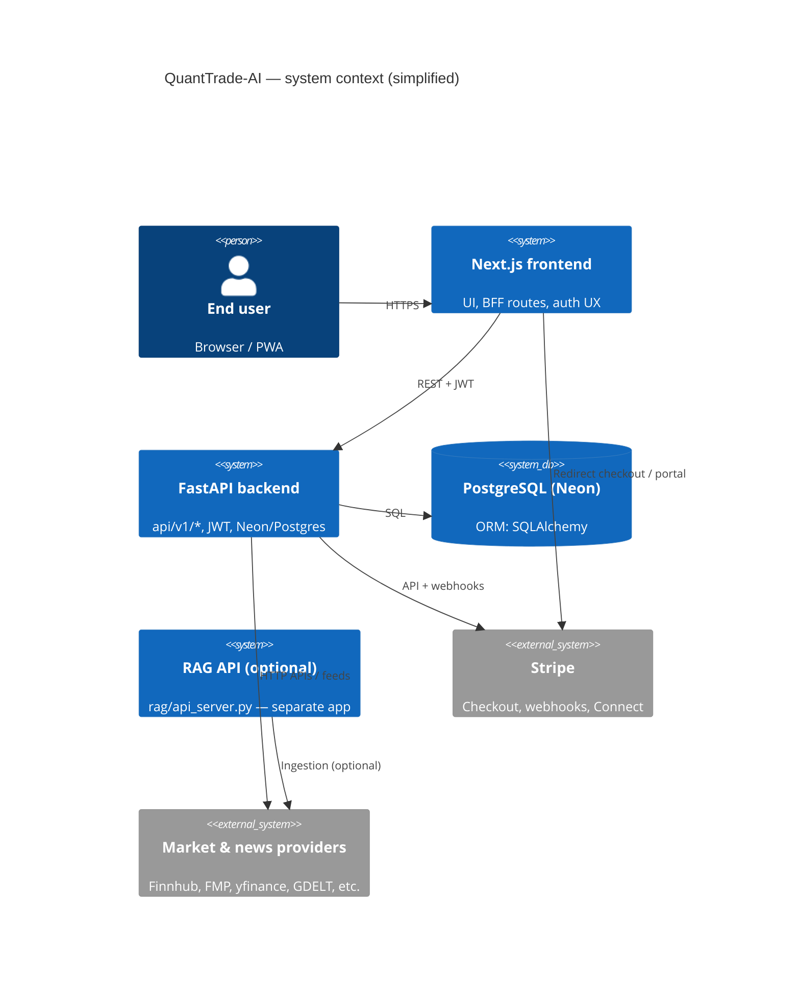
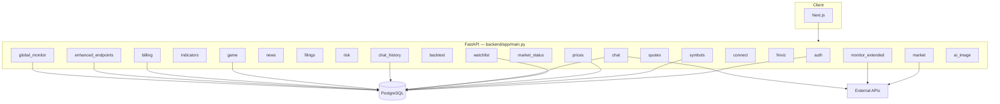
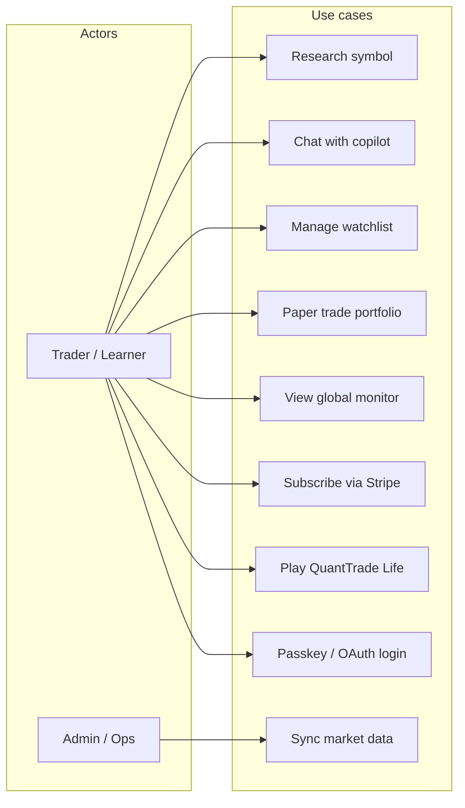
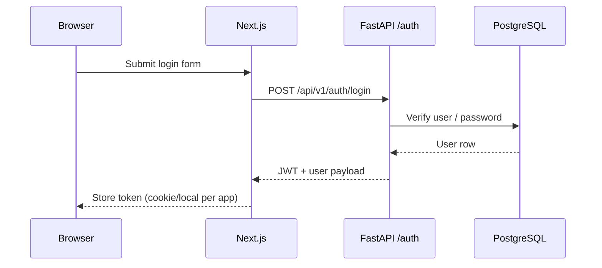
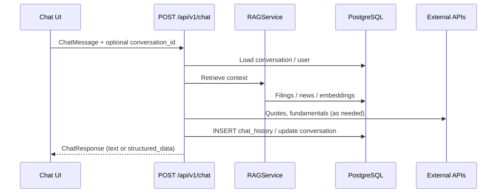
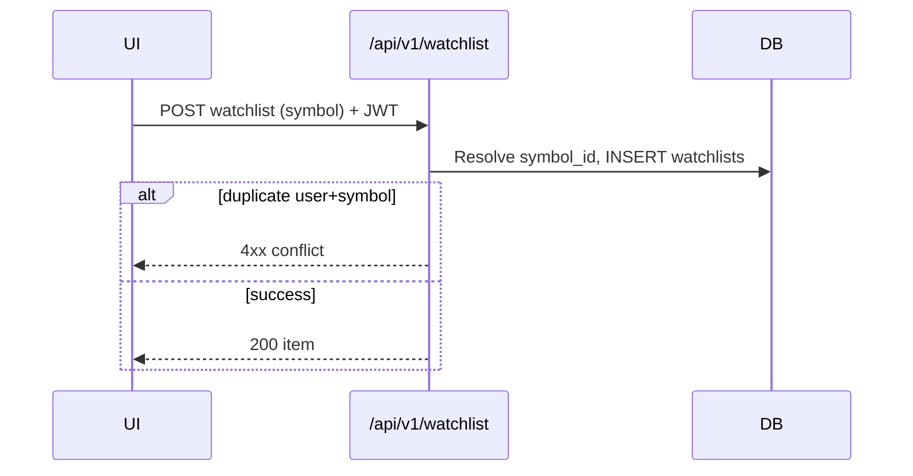
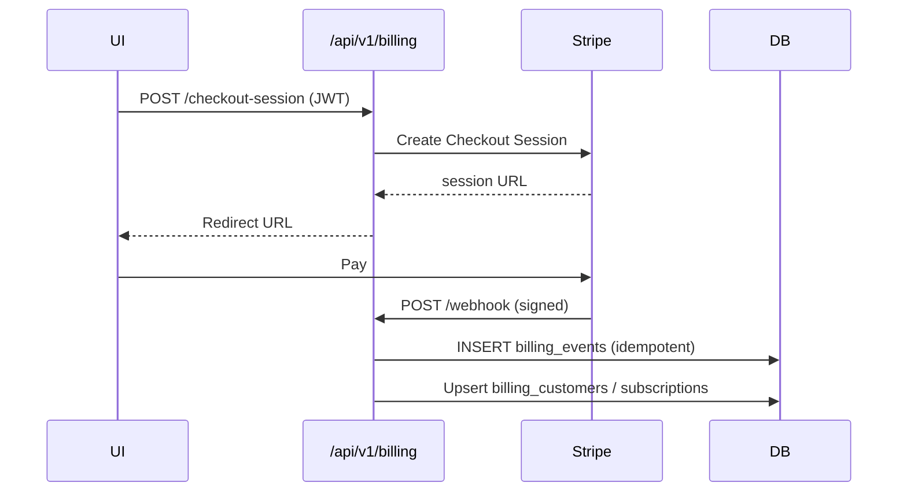
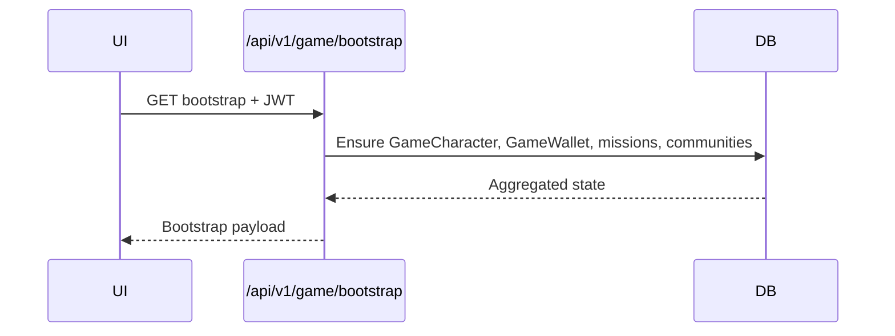
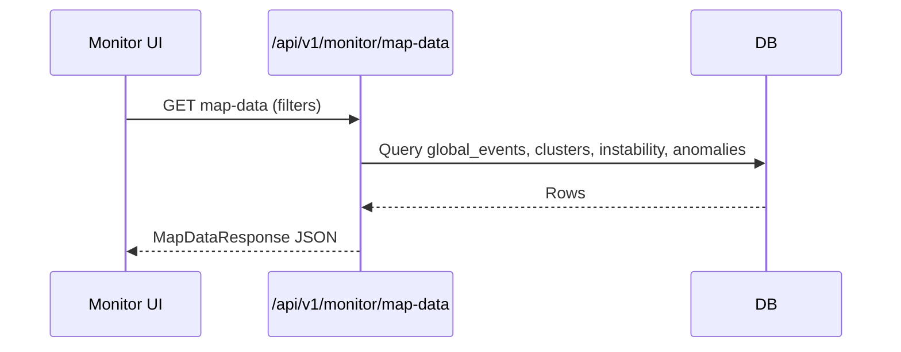

# QuantTrade-AI — System design, APIs, and diagrams

This document maps the **QuantTrade-AI** codebase as of the repository state it was generated from. It covers high-level technical design (HLD), logical data model (ER), primary use cases, sequence flows, and a consolidated **read/write** view of HTTP APIs and backend services.

> **Note:** “HTD” is interpreted here as **high-level technical design** (architecture + interfaces). For low-level field-level specs, rely on FastAPI OpenAPI (`/docs` on each server) and the SQLAlchemy models under `backend/app/models/`.

---

## 1. System context

**Product:** AI-assisted trading and research copilot with market data, news, filings, global risk monitor, paper portfolios, billing (Stripe), gamified “QuantTrade Life” experience, and a separate optional **RAG** service for document-grounded analysis.



---

## 2. High-level technical design (HLD)

### 2.1 Logical layers

| Layer | Location | Responsibility |
|--------|-----------|----------------|
| **Presentation** | `frontend/src` | Next.js App Router pages, React components, client state (`AuthContext`), calls to backend and Next.js `app/api/*` BFF routes. |
| **BFF / edge** | `frontend/src/app/api/**/route.ts` | Proxies or aggregates external APIs (quotes, heatmap, newsletter, OG, FAL, copilot bridge) to hide keys and normalize responses. |
| **Application API** | `backend/app/main.py` | FastAPI app: CORS, cache middleware, router mounting under `/api/v1/...`. |
| **Domain services** | `backend/app/services/*.py` | Fetchers, RAG orchestration, portfolio math, game logic, billing helpers, rate limiting, embeddings, etc. |
| **Persistence** | `backend/app/models/*.py`, `backend/app/db/database.py` | SQLAlchemy models; PostgreSQL via `DATABASE_URL`. |
| **Background jobs** | `main.py` (APScheduler), `backend/app/tasks/` | Exchange universe nightly sync, cleanup; other sync tasks triggered via API. |
| **Optional RAG stack** | `rag/` | Standalone FastAPI + vector ingestion (`rag/api_server.py`). |

### 2.2 Component diagram (backend routers)



### 2.3 Cross-cutting concerns

- **Authentication:** JWT after email/password, Google OAuth, or passkey verification (`backend/app/api/auth.py`, `backend/app/auth/`).
- **Authorization:** Many routes use `get_current_user` / `require_auth`; **game** routes are documented as JWT-protected server-side.
- **Caching:** `CacheControlMiddleware` on selected market paths; `quote_cache`, `ttl_cache`, `QuoteSnapshot` model for quote TTL caching.
- **Idempotency:** Stripe webhooks use `billing_events` (`stripe_event_id` unique).

---

## 3. Service catalog (backend `app/services`)

Services encapsulate **reads/writes** to external systems and shared logic. Representative mapping:

| Service module | Primary role | Typical I/O |
|----------------|--------------|-------------|
| `rag_service.py` | RAG retrieval + LLM orchestration for chat | Read DB/embeddings; call model APIs |
| `stock_analysis_client.py` | Stock prediction / analysis client | External ML/API |
| `fmp_client.py`, `finnhub_fetcher.py`, `data_fetcher.py`, `enhanced_data_fetcher.py` | Market/fundamental/quote data | HTTP read |
| `news_fetcher.py`, `realtime_news_fetcher.py` | News ingestion | HTTP read → DB write |
| `filings_fetcher.py` | SEC filings | HTTP read → DB write |
| `tradingview_fetcher.py`, `finviz_fetcher.py` | Screens / fundamentals-style data | HTTP read |
| `portfolio_service.py` | Portfolio CRUD, trades, positions | DB read/write |
| `backtest_engine.py`, `monte_carlo.py` | Simulation | Compute |
| `indicators.py` | Technical indicators | Read prices → compute |
| `risk_scorer.py` | Symbol/portfolio risk | Read data → score |
| `game_service.py` | QuantTrade Life state machine | DB read/write |
| `billing_service.py` | Stripe customer/subscription sync | Stripe + DB |
| `email_service.py`, `otp_service.py`, `email_verifier_service.py` | Auth comms | SMTP / verification APIs |
| `fal_service.py` | Image generation (FAL) | HTTP |
| `embedding_service.py`, `vector_store.py` | Embeddings / vector storage | External + DB |
| `global_monitor_fetchers.py`, `ais_stream_fetcher.py`, `vesselfinder_fetcher.py`, etc. | Global monitor feeds | HTTP → DB (ingestion jobs) |
| `exchange_universe_service.py` | Ranked exchange universes | DB read/write (scheduled) |
| `quote_cache.py`, `ttl_cache.py` | Quote caching layer | Cache read/write |
| `rate_limiter.py` | Throttling | In-memory / token bucket |
| `prediction_monitoring.py`, `ml_models.py` | ML monitoring / models | DB / batch |
| `comprehensive_analysis.py` | Bundled analysis for copilot | Multiple internal calls |
| `ticker_correlation.py`, `threat_classification.py` | Monitor analytics | Read events → scores |

---

## 4. HTTP API inventory (main backend)

Base URL (typical): `{BACKEND}/api/v1` except **global monitor** uses `/api/v1/monitor/...` and **billing** uses `/api/v1/billing/...`. **Game** uses `/api/v1/game/...`. **Auth** uses `/api/v1/auth/...`.

Legend: **R** = read, **W** = write (DB or external mutation). **Auth** = JWT or session typically required where noted (see each router’s `Depends` in code).

### 4.1 Auth — prefix `/api/v1/auth`

| Method | Path | R/W | Notes |
|--------|------|-----|--------|
| GET | `/validate-email` | R | Email availability / validation |
| POST | `/send-otp` | W | Sends OTP |
| POST | `/verify-otp` | W | Verifies OTP |
| POST | `/register` | W | Creates user, returns tokens |
| POST | `/login` | R/W | Auth, updates session metadata |
| POST | `/google/verify`, `/google` | R/W | Google OAuth flows |
| GET | `/me`, `/session` | R | Current user |
| POST | `/logout` | W | Invalidate / clear |
| POST | `/passkey/register/challenge` | W | WebAuthn |
| POST | `/passkey/register/verify` | W | WebAuthn |
| GET | `/passkey/status`, `/passkey/list` | R | Passkey state |
| POST | `/passkey/auth/challenge` | R | Assertion challenge |
| POST | `/passkey/auth/verify` | W | Issues JWT |
| POST | `/forgot-password`, `/reset-password` | W | Recovery |
| POST | `/test-email` | W | Dev/test email |

### 4.2 Symbols & prices — prefix `/api/v1`

| Method | Path | R/W |
|--------|------|-----|
| GET | `/symbols/search` | R |
| GET | `/symbols`, `/symbols/{symbol}` | R |
| POST | `/symbols/{symbol}/sync` | W |
| GET | `/prices/{symbol}` | R |
| POST | `/prices/{symbol}/sync` | W |
| GET | `/prices/{symbol}/quote` | R |
| GET | `/indicators/{symbol}` | R |

### 4.3 Chat & history — prefix `/api/v1`

| Method | Path | R/W | Notes |
|--------|------|-----|--------|
| POST | `/chat` | R/W | Copilot: RAG, intents, may persist messages |
| POST | `/conversations` | W | New thread |
| GET | `/conversations` | R | List threads |
| GET | `/conversations/{id}/messages` | R | Messages |
| DELETE | `/conversations/{id}` | W | Delete thread |
| POST | `/chat/refresh` | W | Refresh assistant message |
| GET | `/chat/history` | R | Legacy flat history |
| DELETE | `/chat/history` | W | Clear legacy history |

### 4.4 News & filings — prefix `/api/v1`

| Method | Path | R/W |
|--------|------|-----|
| GET | `/news/{symbol}` | R |
| POST | `/news/{symbol}/sync` | W |
| GET | `/news/{symbol}/sync` | R |
| GET | `/news/live/market`, `/news/live/{symbol}` | R |
| GET | `/news/finnhub/{symbol}` | R |
| GET | `/news/combined/{symbol}` | R |
| GET | `/news/realtime/market`, `/news/realtime/{symbol}` | R |
| GET | `/news/all/{symbol}` | R |
| GET | `/filings/{symbol}` | R |
| GET | `/filings/{symbol}/{filing_id}` | R |
| POST | `/filings/{symbol}/sync` | W |

### 4.5 Watchlist, risk, backtest — prefix `/api/v1`

| Method | Path | R/W |
|--------|------|-----|
| GET | `/watchlist` | R |
| POST | `/watchlist` | W |
| DELETE | `/watchlist/{id}` | W |
| PUT | `/watchlist/{id}` | W |
| GET | `/risk/{symbol}` | R |
| GET | `/risk/portfolio` | R |
| POST | `/backtest` | R (compute) |
| GET | `/strategies` | R |

### 4.6 Market & quotes — prefix `/api/v1`

| Method | Path | R/W |
|--------|------|-----|
| GET | `/market/ipo-calendar` | R |
| GET | `/market/coverage` | R |
| GET | `/market/stocks` | R |
| GET | `/market/sectors` | R |
| GET | `/market/heatmap` | R |
| GET | `/market/gainers`, `/losers`, `/movers` | R |
| GET | `/market/universe` | R |
| GET | `/market/status` | R |
| GET | `/quotes` | R |
| GET | `/quotes/{symbol}` | R |
| GET | `/finviz/{symbol}` | R |

### 4.7 Enhanced endpoints — prefix `/api/v1/enhanced`

| Method | Path | R/W |
|--------|------|-----|
| GET | `/quote/{symbol}` | R |
| GET | `/market-indices` | R |
| GET | `/news/{symbol}/realtime`, `/yfinance`, `/finnhub` | R |
| GET | `/news/market/breaking`, `/news/market/finnhub` | R |
| GET | `/fundamentals/{symbol}` | R |
| POST | `/fundamentals/{symbol}/sync` | W |
| POST | `/sync/sp500`, `/sync/nasdaq` | W |
| POST | `/portfolio/create` | W |
| GET | `/portfolio/{id}/summary` | R |
| POST | `/portfolio/{id}/trade` | W |
| GET | `/portfolio/{id}/positions`, `/transactions` | R |
| GET | `/quote/{symbol}/finnhub` | R |
| GET | `/company/{symbol}/profile` | R |
| GET | `/sentiment/{symbol}`, `/recommendations/{symbol}` | R |
| GET | `/api-stats` | R |
| GET | `/alerts/predictions` | R |

### 4.8 Billing & Connect — prefixes `/api/v1/billing`, `/api/v1/connect`

**Billing**

| Method | Path | R/W |
|--------|------|-----|
| POST | `/checkout-session` | W (Stripe session) |
| GET | `/session-status` | R |
| GET | `/subscription-status` | R |
| POST | `/portal` | W (Stripe portal URL) |
| POST | `/webhook` | W (Stripe events → DB) |

**Connect** (Stripe Connect–style account / storefront — see `connect.py`)

| Method | Path | R/W |
|--------|------|-----|
| POST | `/account` | W |
| GET | `/account/status` | R |
| POST | `/account/onboarding-link` | W |
| POST | `/products` | W |
| GET | `/storefront/{account_id}/products` | R |
| POST | `/storefront/checkout` | W |
| POST | `/subscription/checkout` | W |
| POST | `/subscription/portal` | W |
| POST | `/webhooks/connect-thin`, `/webhooks/billing` | W |

### 4.9 Global monitor — prefix `/api/v1/monitor`

**Core (`global_monitor.py`)**

| Method | Path | R/W |
|--------|------|-----|
| GET | `/events`, `/hotspots`, `/instability`, `/anomalies` | R |
| GET | `/ticker-impact/{event_id}` | R |
| GET | `/map-data` | R |
| GET | `/stats`, `/health` | R |

**Extended (`monitor_extended.py`)** — all GET, read-only aggregation from external APIs + DB where applicable:

`/market-radar`, `/economic-indicators`, `/trade-policy`, `/continent-news`, `/polymarket-finance`, `/acled-conflicts`, `/commodities`, `/energy-data`, `/internet-outages`, etc.

### 4.10 Game (QuantTrade Life) — prefix `/api/v1/game`

| Method | Path | R/W |
|--------|------|-----|
| GET | `/bootstrap` | R/W (ensure game state) |
| GET | `/character` | R |
| POST | `/character/update` | W |
| GET | `/wallet` | R |
| GET | `/missions` | R |
| POST | `/mission/complete` | W |
| POST | `/audio/voiceover` | R/W (TTS side effect) |
| GET | `/community` | R |
| GET | `/stage-config` | R |

### 4.11 AI image — prefix `/api/v1/ai-image`

| Method | Path | R/W |
|--------|------|-----|
| POST | `/stock-visual` | W (generation) |
| POST | `/og-image` | W |
| POST | `/game-asset` | W |

### 4.12 App root

| Method | Path | R/W |
|--------|------|-----|
| GET | `/` | R |
| GET | `/health` | R |

---

## 5. Next.js BFF routes (`frontend/src/app/api`)

These are **server-side** routes in the Next app (often proxying external APIs):

| Route | Role |
|--------|------|
| `copilot/route.ts` | Copilot bridge |
| `newsletter/route.ts` | Newsletter signup |
| `exchange/heatmap/route.ts`, `exchange/universe/route.ts` | Market universe / heatmap |
| `quotes/chart/route.ts`, `quotes/indices/route.ts`, `quotes/movers/route.ts`, `quotes/ticker/route.ts` | Quote aggregation |
| `search/global/route.ts` | Global search proxy |
| `finnhub/route.ts` | Finnhub proxy |
| `currencies/route.ts` | FX |
| `fal/route.ts` | FAL image API proxy |
| `og/route.ts` | OG image |

---

## 6. Optional RAG service (`rag/api_server.py`)

Separate FastAPI app (not mounted in `backend/app/main.py` unless deployed together).

| Method | Path | R/W |
|--------|------|-----|
| GET | `/`, `/health` | R |
| POST | `/api/analyze/stock` | R (compute) |
| POST | `/api/analyze/fundamental`, `/sentiment`, `/technical`, `/holistic` | R |
| POST | `/api/analyze/compare` | R |
| POST | `/api/chat/stock` | R |
| POST | `/api/ingest` | W |
| GET | `/api/stocks/{symbol}/documents` | R |

---

## 7. Use case diagram



---

## 8. Sequence diagrams

### 8.1 User authentication (email + JWT)



### 8.2 Copilot chat with persistence



### 8.3 Watchlist write



### 8.4 Stripe subscription (checkout + webhook)



### 8.5 Game bootstrap (first visit)



### 8.6 Global monitor read path



---

## 9. ER diagram (core domain)

The diagram focuses on **foreign keys** and principal entities. Global monitor tables (`global_events`, `country_instability`, etc.) are mostly standalone (references by `event_id` string in `ticker_impacts`, not FK to `global_events.id`).

```mermaid
erDiagram
  users ||--o{ watchlists : has
  users ||--o{ portfolios : has
  users ||--o{ conversations : has
  users ||--o{ chat_history : has
  users ||--o| billing_customers : maps
  users ||--o| subscriptions : maps
  users ||--o| connected_accounts : maps
  users ||--o| passkey_credentials : has
  users ||--|| game_characters : has

  symbols ||--o{ price_bars : has
  symbols ||--o{ news_articles : has
  symbols ||--o{ filings : has
  symbols ||--o| fundamentals : has
  symbols ||--o| realtime_quotes : has
  symbols ||--o{ watchlists : referenced_by
  symbols ||--o{ positions : referenced_by
  symbols ||--o{ transactions : referenced_by

  filings ||--o{ filing_chunks : contains

  portfolios ||--o{ positions : has
  portfolios ||--o{ transactions : has
  portfolios ||--o{ portfolio_snapshots : has

  conversations ||--o{ chat_history : contains

  game_characters ||--|| game_wallets : has
  game_characters ||--o{ game_missions : has
  game_characters ||--o{ game_portfolio_holdings : has
  game_characters ||--o{ game_event_logs : has
  game_characters }o--o{ game_community_groups : game_character_communities

  users {
    int id PK
    string email UK
    string username UK
  }

  symbols {
    int id PK
    string symbol UK
  }

  watchlists {
    int id PK
    int user_id FK
    int symbol_id FK
  }

  portfolios {
    int id PK
    int user_id FK
  }

  positions {
    int id PK
    int portfolio_id FK
    int symbol_id FK
  }

  transactions {
    int id PK
    int portfolio_id FK
    int symbol_id FK
  }

  conversations {
    string id PK
    int user_id FK
  }

  chat_history {
    int id PK
    int user_id FK
    string conversation_id FK
  }

  game_characters {
    int id PK
    int user_id FK UK
  }

  game_wallets {
    int id PK
    int character_id FK UK
  }

  billing_customers {
    int user_id PK FK
    string stripe_customer_id UK
  }

  subscriptions {
    int user_id PK FK
    string stripe_subscription_id UK
  }
```

**Additional tables** (no FK to `users` in model file — cache / ops):

- `quote_snapshots` (symbol UK, JSONB payload)
- `news_cache`, `symbols_master`, `exchange_ranked_symbols`
- `ml_models`, `ml_feature_stats`, `ml_prediction_stats`, `sec_api_usage`
- Global monitor: `global_events`, `country_instability`, `event_anomalies`, `geographic_clusters`, `ticker_impacts`, `data_ingestion_logs`, `market_impact_history`

---

## 10. Read vs write summary (design view)

| Domain | Primary read APIs | Primary write APIs |
|--------|-------------------|---------------------|
| Identity | `/auth/me`, passkey status | register, login, passkey verify, logout |
| Market data | prices, quotes, market/*, finviz | `*/sync` POSTs |
| Intelligence | chat, news, filings, risk, backtest | chat persistence, sync |
| Portfolio | enhanced portfolio GETs | create, trade |
| Social/game | game GETs | character update, mission complete |
| Billing | session-status, subscription-status | checkout-session, portal, webhooks |
| Monitor | `/monitor/*` GET | Ingestion via jobs/services (not always exposed as REST) |

---

## 11. Maintenance

- **OpenAPI:** Run the backend and open `/docs` for authoritative request/response schemas.
- **Drift:** When you add routers in `main.py` or models under `models/`, update this document’s sections **4**, **6**, and **9**.

---

*Generated from repository structure: `backend/app/main.py`, `backend/app/api/*`, `backend/app/models/*`, `backend/app/services/*`, `frontend/src/lib/api.ts`, `frontend/src/app/api/*`, `rag/api_server.py`.*
